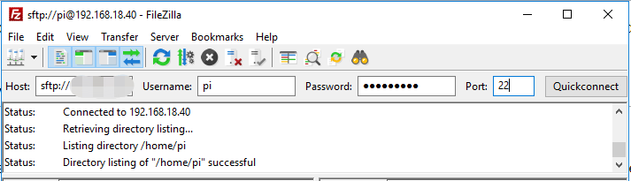

.. _filezilla:

Filezilla-Software
==========================

.. image:: img/filezilla_icon.png

Das File Transfer Protocol (FTP) ist ein Standardkommunikationsprotokoll, das für die Übertragung von Computerdateien von einem Server auf einen Client in einem Computernetzwerk verwendet wird.

Filezilla ist eine Open-Source-Software, die nicht nur FTP unterstützt, sondern auch FTP über TLS (FTPS) und SFTP. Wir können Filezilla verwenden, um lokale Dateien (wie Bilder und Audio usw.) auf den Raspberry Pi hochzuladen oder Dateien vom Raspberry Pi auf das lokale Gerät herunterzuladen.

**Schritt 1**: Filezilla herunterladen.

Laden Sie den Client von der `offiziellen Filezilla-Website <https://filezilla-project.org/>`_ herunter. Filezilla bietet ein sehr gutes Tutorial, bitte siehe: `Dokumentation - Filezilla <https://wiki.filezilla-project.org/Documentation>`_.

**Schritt 2**: Verbindung zum Raspberry Pi herstellen

Nach einer schnellen Installation öffnen Sie es und `verbinden es mit einem FTP-Server <https://wiki.filezilla-project.org/Using#Connecting_to_an_FTP_server>`_. Es gibt 3 Möglichkeiten zur Verbindung, hier verwenden wir die **Schnellverbindungsleiste**. Geben Sie den **Hostnamen/IP**, **Benutzernamen**, **Passwort** und **Port (22)** ein, dann klicken Sie auf **Schnellverbinden** oder drücken **Enter**, um eine Verbindung zum Server herzustellen.

.. note::

    Schnellverbinden ist eine gute Möglichkeit, Ihre Anmeldeinformationen zu testen. Wenn Sie einen dauerhaften Eintrag erstellen möchten, können Sie nach einer erfolgreichen Schnellverbindung **Datei** -> **Aktuelle Verbindung in den Site-Manager kopieren** auswählen, den Namen eingeben und auf **OK** klicken. Beim nächsten Mal können Sie sich verbinden, indem Sie die zuvor gespeicherte Site unter **Datei** -> **Site-Manager** auswählen.
    
    .. image:: img/ftp_site.png

**Schritt 3**: Dateien hochladen/herunterladen.

Sie können lokale Dateien auf den Raspberry Pi hochladen, indem Sie sie per Drag & Drop ziehen, oder die Dateien im Raspberry Pi
lokal herunterladen.

.. image:: img/upload_ftp.png
