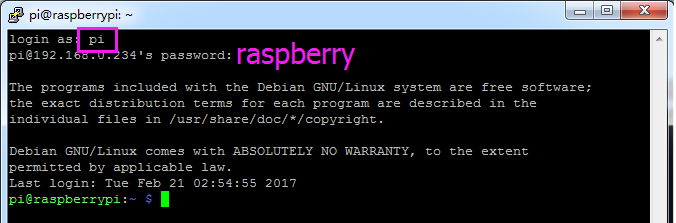

.. note::

    Bonjour, bienvenue dans la communauté SunFounder Raspberry Pi & Arduino & ESP32 Enthusiasts sur Facebook ! Plongez plus profondément dans l’univers de Raspberry Pi, Arduino et ESP32 avec d’autres passionnés.

    **Pourquoi rejoindre ?**

    - **Support d'experts** : Résolvez les problèmes après-vente et relevez les défis techniques avec l'aide de notre communauté et de notre équipe.
    - **Apprendre et partager** : Échangez des astuces et des tutoriels pour améliorer vos compétences.
    - **Aperçus exclusifs** : Bénéficiez d’un accès anticipé aux annonces de nouveaux produits et à des avant-premières.
    - **Réductions spéciales** : Profitez de remises exclusives sur nos produits les plus récents.
    - **Promotions festives et concours** : Participez à des concours et à des promotions spéciales lors des fêtes.

    👉 Prêt à explorer et à créer avec nous ? Cliquez sur [|link_sf_facebook|] et rejoignez-nous dès aujourd'hui !

.. _login_windows:

PuTTY
=========================

Si vous êtes un utilisateur de Windows, vous pouvez utiliser certaines applications SSH. Ici, nous recommandons `PuTTY <https://www.chiark.greenend.org.uk/~sgtatham/putty/latest.html>`_.

**Étape 1**

Téléchargez PuTTY.

**Étape 2**

Ouvrez PuTTY et cliquez sur **Session** dans la structure arborescente à gauche. Entrez l'adresse IP du Raspberry Pi dans la zone de texte sous **Host Name (or IP address)** et **22** sous **Port** (par défaut, c’est 22).

.. image:: img/image25.png
    :align: center

**Étape 3**

Cliquez sur **Open**. Notez que lors de votre première connexion au Raspberry Pi avec l’adresse IP, un message de sécurité s’affiche. Cliquez simplement sur **Yes**.

**Étape 4**

Lorsque la fenêtre PuTTY affiche \"**login as:**\", tapez \"**pi**\" 
(le nom d'utilisateur du Raspberry Pi), et **mot de passe** : \"raspberry\" 
(le mot de passe par défaut, si vous ne l'avez pas modifié).

.. note::

    Lorsque vous saisissez le mot de passe, les caractères ne s'affichent pas dans la fenêtre, ce qui est normal. Vous devez simplement entrer le mot de passe correct.

    Si le message inactif apparaît à côté de PuTTY, cela signifie que la connexion a été interrompue et doit être rétablie.

**Étape 5**

À ce stade, nous avons connecté le Raspberry Pi, et il est temps de passer aux étapes suivantes.
