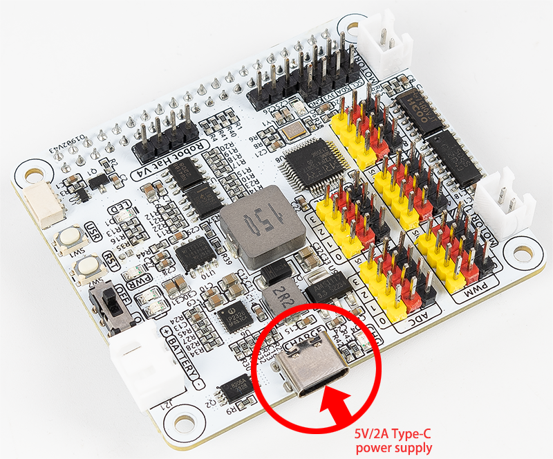

.. note::

    こんにちは！SunFounderのRaspberry Pi & Arduino & ESP32愛好者コミュニティへようこそ！Raspberry Pi、Arduino、ESP32に関する情報を、他の愛好者と一緒に深掘りしていきましょう。

    **なぜ参加するべきか？**

    - **専門的なサポート**：購入後の問題や技術的な課題を、コミュニティやチームのサポートで解決しましょう。
    - **学びと共有**：ヒントやチュートリアルを交換して、スキルを向上させましょう。
    - **限定プレビュー**：新製品の発表前にアクセスし、先取り情報を得ることができます。
    - **特別割引**：最新製品に対する限定割引を楽しみましょう。
    - **季節ごとのキャンペーンとプレゼント企画**：プレゼント企画やホリデーキャンペーンに参加しましょう。

    👉 私たちと一緒に探索し、創造を始めませんか？[|link_sf_facebook|]をクリックして、今すぐ参加しましょう！

FAQ
===========================

Q1: "pinctrl: not found"エラーについて
-------------------------------------------------------------------

次のエラーが表示された場合：

.. code-block::

    pinctrl: not found

これは、Bullseyeシステムがインストールされていることを意味します。代わりに **Bookwormシステム** をインストールすることをお勧めします。

Q2: バッテリーチャージャーについて
-------------------------------------------------------------------

バッテリーを充電するには、5V/2AのType-C電源をRobot Hatの電源ポートに接続するだけで構いません。充電中にRobot Hatの電源スイッチをオンにする必要はありません。
充電中でもデバイスを使用することができます。

充電中は、充電チップが入力電力をブーストしてバッテリーを充電すると同時に、外部用のDC-DCコンバータに電力を供給します。充電出力はおおよそ10Wです。
外部の消費電力が長時間にわたって高い状態が続く場合、バッテリーが電力供給を補助することがあります。これは、スマートフォンを充電しながら使用する場合と似ています。ただし、同時に充電と使用を行う際には、バッテリー容量が完全に消耗しないよう注意してください。
