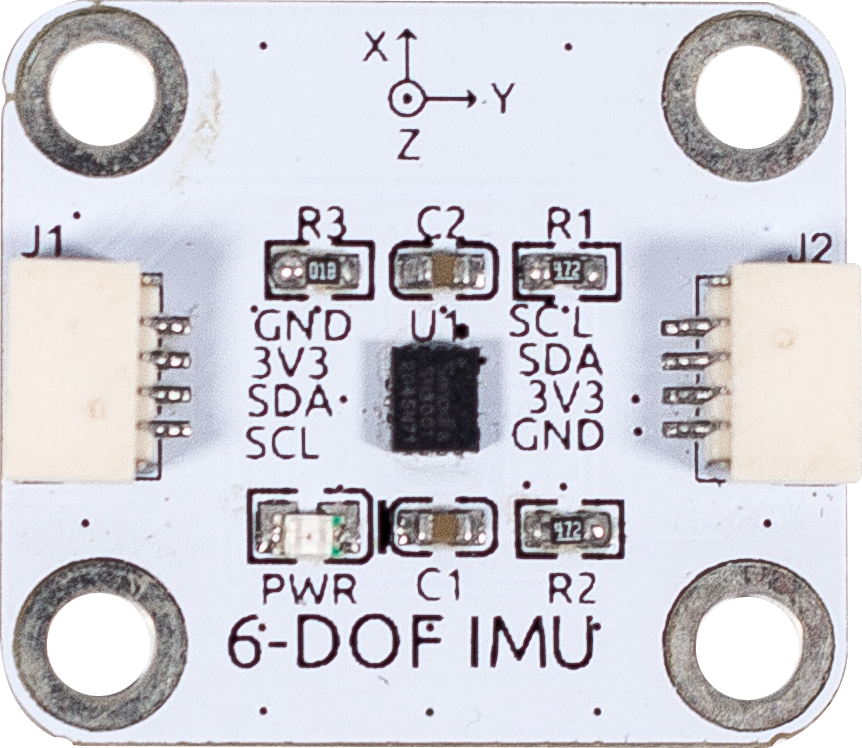

.. note::

    Bonjour, bienvenue dans la communauté SunFounder Raspberry Pi & Arduino & ESP32 Enthusiasts sur Facebook ! Plongez plus profondément dans l’univers de Raspberry Pi, Arduino et ESP32 avec d’autres passionnés.

    **Pourquoi rejoindre ?**

    - **Support d'experts** : Résolvez les problèmes après-vente et relevez les défis techniques avec l'aide de notre communauté et de notre équipe.
    - **Apprendre et partager** : Échangez des astuces et des tutoriels pour améliorer vos compétences.
    - **Aperçus exclusifs** : Bénéficiez d’un accès anticipé aux annonces de nouveaux produits et à des avant-premières.
    - **Réductions spéciales** : Profitez de remises exclusives sur nos produits les plus récents.
    - **Promotions festives et concours** : Participez à des concours et à des promotions spéciales lors des fêtes.

    👉 Prêt à explorer et à créer avec nous ? Cliquez sur [|link_sf_facebook|] et rejoignez-nous dès aujourd'hui !

6-DOF IMU
==========================

L'IMU 6-DOF est basé sur le SH3001.

Le SH3001 est une unité de mesure inertielle (IMU) à six axes. Il intègre un gyroscope à trois axes et un accéléromètre à trois axes. Il est de petite taille et consomme peu d'énergie. Il est adapté aux applications du marché de l’électronique grand public et peut fournir des données de vitesse angulaire et d'accélération linéaire en temps réel avec une grande précision. Le SH3001 offre une excellente stabilité thermique et maintient une haute résolution dans une plage de fonctionnement allant de -40°C à 85°C.

Il est couramment utilisé dans les smartphones, tablettes, drones multi-rotors, aspirateurs intelligents, pointeurs laser, AR/VR, télécommandes intelligentes, bracelets connectés et d'autres produits.

**Caractéristiques**

* Alimentation : 3,3V
* Communication : IIC
* Connecteur : SH1.0 4P

**Brochage**

* GND - Entrée Masse
* VCC - Entrée Alimentation
* SDA - IIC SDA
* SCL - IIC SCL

