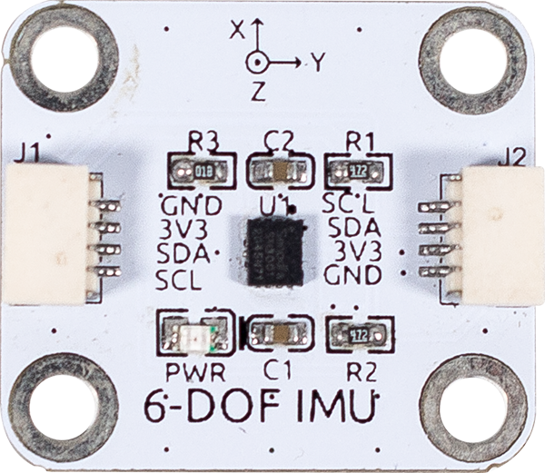

6軸IMU
==========================

6軸IMUはSH3001をベースにしています。

SH3001は6軸IMU（慣性計測ユニット）です。3軸ジャイロスコープと3軸加速度計を統合しています。サイズが小さく、消費電力が少ないため、消費者向け電子機器の市場向けアプリケーションに適しており、高精度のリアルタイム角速度および線形加速度データを提供できます。SH3001は優れた温度安定性を持ち、-40°Cから85°Cの動作範囲内で高い解像度を維持できます。

通常、スマートフォン、タブレットコンピュータ、マルチロータードローン、スマート掃除機、ページ送りレーザーポインター、AR/VR、スマートリモコン、スマートブレスレットなどの製品に使用されます。

**仕様**

* 電源供給: 3.3V
* 通信: IIC
* コネクタ: SH1.0 4P

**ピン配置**

* GND - グラウンド入力
* VCC - 電源供給入力
* SDA - IIC SDA
* SCL - IIC SCL

