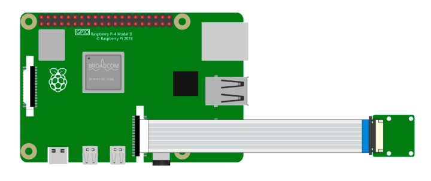

.. note::

    Ciao! Benvenuto nella Community di appassionati di Raspberry Pi, Arduino e ESP32 di SunFounder su Facebook! Approfondisci le tue conoscenze su Raspberry Pi, Arduino ed ESP32 insieme ad altri entusiasti.

    **Perché unirti?**

    - **Supporto Esperto**: Risolvi problemi post-vendita e affronta le sfide tecniche con l'aiuto del nostro team e della comunità.
    - **Impara e Condividi**: Scambia consigli e tutorial per migliorare le tue competenze.
    - **Anteprime Esclusive**: Ottieni accesso anticipato agli annunci di nuovi prodotti e alle anteprime esclusive.
    - **Sconti Speciali**: Approfitta di sconti esclusivi sui nostri prodotti più recenti.
    - **Promozioni e Concorsi Festivi**: Partecipa a concorsi e promozioni durante le festività.

    👉 Sei pronto a esplorare e creare con noi? Clicca su [|link_sf_facebook|] e unisciti oggi stesso!

Modulo Fotocamera
=====================

**Descrizione**

.. image:: img/camera_module_pic.png
   :width: 200
   :align: center

Questo è un modulo fotocamera per Raspberry Pi da 5 MP con sensore OV5647. È plug and play: collega il cavo flat incluso alla porta CSI (Camera Serial Interface) del tuo Raspberry Pi e sei pronto a partire.

La scheda è piccola, circa 25mm x 23mm x 9mm e pesa solo 3g, rendendola ideale per applicazioni mobili o per altri contesti in cui dimensioni e peso sono fondamentali. Il modulo ha una risoluzione nativa di 5 megapixel e una lente con messa a fuoco fissa che cattura immagini statiche a 2592 x 1944 pixel. Supporta anche video in 1080p30, 720p60 e 640x480p90.

.. note:: 

   Il modulo è in grado di catturare solo immagini e video, non registra audio.

**Specifiche Tecniche**

* **Risoluzione Immagini Statiche**: 2592×1944 
* **Risoluzione Video Supportata**: 1080p/30 fps, 720p/60 fps e 640x480p a 60/90 fps
* **Apertura (F)**: 1.8 
* **Angolo Visivo**: 65 gradi 
* **Dimensioni**: 24mm x 23.5mm x 8mm 
* **Peso**: 3g 
* **Interfaccia**: Connettore CSI 
* **Sistemi Operativi Supportati**: Raspberry Pi OS (si raccomanda l'ultima versione)

**Assemblare il Modulo Fotocamera**

Sul modulo fotocamera o sul Raspberry Pi, troverai un connettore di plastica piatto. Estrai delicatamente l'interruttore di fissaggio nero fino a quando non è parzialmente estratto. Inserisci il cavo FFC nel connettore di plastica nella direzione mostrata e riposiziona l'interruttore di fissaggio.

Se il cavo FFC è installato correttamente, sarà dritto e non si staccherà quando viene tirato delicatamente. Se non è fissato correttamente, reinstallalo.

.. image:: img/connect_ffc.png

.. warning::

   Non installare la fotocamera con l'alimentazione accesa, poiché potrebbe danneggiarla.

.. **Enable the Camera Interface**

.. Run the following command to enable the camera interface of your Raspberry Pi. If you have enabled it, skip this; if you do not know whether you have done that or not, please continue.

.. .. raw:: html

..    <run></run>

.. .. code-block:: 

..    sudo raspi-config

.. **3 Interfacing options**

.. .. image:: img/image282.png
..    :align: center

.. **P1 Camera**

.. .. image:: img/camera_config1.png
..    :align: center

.. **<Yes>, then <Ok> -> <Finish>**

.. .. image:: img/camera_config2.png
..    :align: center

.. After the configuration is complete, it is recommended to reboot the Raspberry Pi.

.. .. raw:: html

..    <run></run>

.. .. code-block:: 

..    sudo reboot