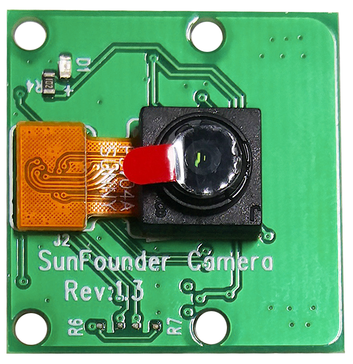

.. note::

    Hallo und willkommen in der SunFounder Raspberry Pi & Arduino & ESP32 Enthusiasten-Gemeinschaft auf Facebook! Tauchen Sie tiefer ein in die Welt von Raspberry Pi, Arduino und ESP32 mit anderen Enthusiasten.

    **Warum beitreten?**

    - **Expertenunterstützung**: Lösen Sie Nachverkaufsprobleme und technische Herausforderungen mit Hilfe unserer Gemeinschaft und unseres Teams.
    - **Lernen & Teilen**: Tauschen Sie Tipps und Anleitungen aus, um Ihre Fähigkeiten zu verbessern.
    - **Exklusive Vorschauen**: Erhalten Sie frühzeitigen Zugang zu neuen Produktankündigungen und exklusiven Einblicken.
    - **Spezialrabatte**: Genießen Sie exklusive Rabatte auf unsere neuesten Produkte.
    - **Festliche Aktionen und Gewinnspiele**: Nehmen Sie an Gewinnspielen und Feiertagsaktionen teil.

    👉 Sind Sie bereit, mit uns zu erkunden und zu erschaffen? Klicken Sie auf [|link_sf_facebook|] und treten Sie heute bei!

Kameramodul
====================================

**Beschreibung**

Dies ist ein 5MP Raspberry Pi Kameramodul mit OV5647-Sensor. Es ist Plug-and-Play, verbinden Sie das mitgelieferte Flachbandkabel mit dem CSI (Camera Serial Interface) Anschluss Ihres Raspberry Pi und Sie sind bereit.

Das Modul ist klein, etwa 25mm x 23mm x 9mm, und wiegt 3g, was es ideal für mobile oder andere größen- und gewichtskritische Anwendungen macht. Das Kameramodul hat eine native Auflösung von 5 Megapixeln und verfügt über eine fest fokussierte Linse an Bord, die Standbilder mit 2592 x 1944 Pixeln aufnimmt, und unterstützt auch 1080p30, 720p60 und 640x480p90 Video.

.. note:: 

   Das Modul kann nur Bilder und Videos aufnehmen, keinen Ton.

**Spezifikation**

* **Auflösung statischer Bilder**: 2592×1944 
* **Unterstützte Videoauflösung**: 1080p/30 fps, 720p/60fps und 640x480p 60/90 Videoaufnahme 
* **Blende (F)**: 1.8 
* **Sichtwinkel**: 65 Grad 
* **Abmessungen**: 24mmx23.5mmx8mm 
* **Gewicht**: 3g 
* **Schnittstelle**: CSI-Anschluss 
* **Unterstütztes Betriebssystem**: Raspberry Pi OS (neueste Version empfohlen) 

**Montieren des Kameramoduls**

Am Kameramodul oder Raspberry Pi finden Sie einen flachen Plastikanschluss. Ziehen Sie vorsichtig den schwarzen Fixierschalter heraus, bis der Fixierschalter teilweise herausgezogen ist. Stecken Sie das FFC-Kabel in die Richtung, die auf dem Plastikanschluss angezeigt wird, und schieben Sie den Fixierschalter zurück an seinen Platz.

Wenn das FFC-Kabel korrekt installiert ist, wird es gerade sein und sich nicht herausziehen lassen, wenn Sie vorsichtig daran ziehen. Wenn nicht, installieren Sie es erneut.

.. image:: img/connect_ffc.png
.. image:: img/1.10_camera.png
   :width: 700

.. warning::

   Installieren Sie die Kamera nicht, während der Strom eingeschaltet ist, es könnte Ihre Kamera beschädigen.
