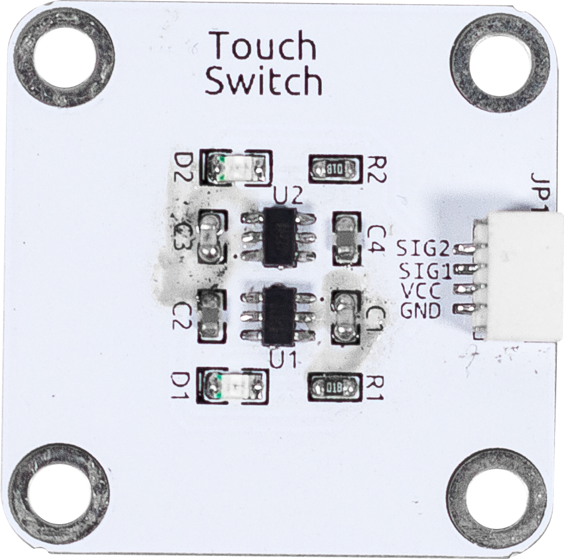

双触摸传感器
==================================

基于两个ttp223触摸传感器的双通道触摸传感器。
当检测到触摸信号时，相应的引脚电平将被拉低。

TTP223是一种触摸板检测IC，提供1个触摸键。
这种触摸检测IC专为替代传统的直接按键而设计，适用于不同尺寸的触摸板。
其特点是低功耗和宽操作电压范围。

**规格**

* 电源供应：2.0V~5.5V
* 信号输出：数字信号
* 连接器：SH1.0 4P

**管脚定义**

* GND - 地线输入
* VCC - 电源输入
* SIG1 - 触摸信号1，低电平表示触摸
* SIG2 - 触摸信号2，低电平表示触摸
