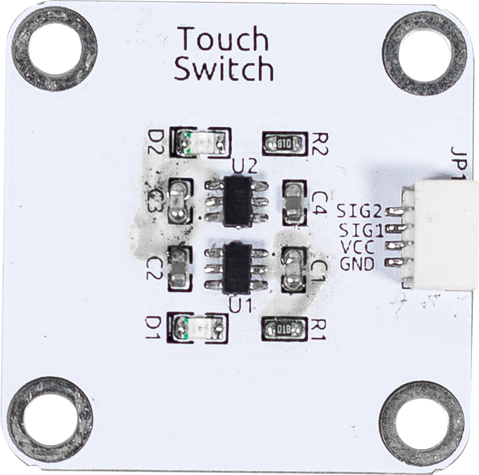

Dual Touch Sensor
==================================

Dual channel touch sensor, based on two ttp223 touch sensors.
When a touch signal is detected, the corresponding pin level will be pulled low.

TTP223 is a touch pad detector IC that provides 1 touch key.
The touch detection IC is specially designed to replace the traditional direct keys with different pad sizes.
It features low power consumption and wide operating voltage.

**Specifications**

* Power Supply: 2.0V~5.5V
* Signal Output: Digital signal
* Connector: SH1.0 4P

**Pin Out**

* GND - Ground Input
* VCC - Power Supply Input
* SIG1 - Touch signal 1, low level means touch
* SIG2 - Touch signal 2, low level means touch
