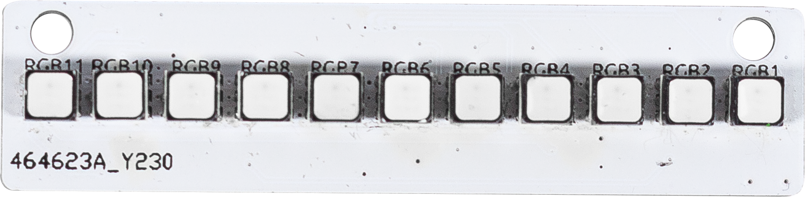

.. note:: 

    您好，欢迎加入SunFounder Raspberry Pi & Arduino & ESP32爱好者Facebook社群！在这里，您可以与其他爱好者一起深入探讨Raspberry Pi、Arduino和ESP32的世界。

    **Why Join?**

    - **Expert Support**：解决售后问题及技术挑战，我们的社区和团队将提供帮助。
    - **Learn & Share**：交流技巧和教程，提升您的技能。
    - **Exclusive Previews**：抢先获取新产品公告和预览。
    - **Special Discounts**：享受我们最新产品的独家折扣。
    - **Festive Promotions and Giveaways**：参与节日促销和赠品活动。

    👉 准备好与我们一起探索和创造了吗？点击[|link_sf_facebook|]，立即加入！

11通道光板
=============================

这是一个11通道RGB LED模块，配备了11个由SLED1735芯片控制的RGB LED。

SLED1734可以驱动多达256个LED和75个RGB LED。
在由SLED1734控制的LED阵列中，每个LED都具有开/关、闪烁、呼吸灯以及自动同步等多种功能。
该芯片内置了PWM（脉冲宽度调制）技术，可提供256级亮度调节。它还具有16级点校正功能。

**规格**

* 电源供应：3.3V
* 通讯方式：IIC
* 连接器：SH1.0 4P
* LED类型：3535 RGB LED

**管脚定义**

* GND - 地线输入
* VCC - 电源输入
* SDA - IIC SDA
* SCL - IIC SCL
