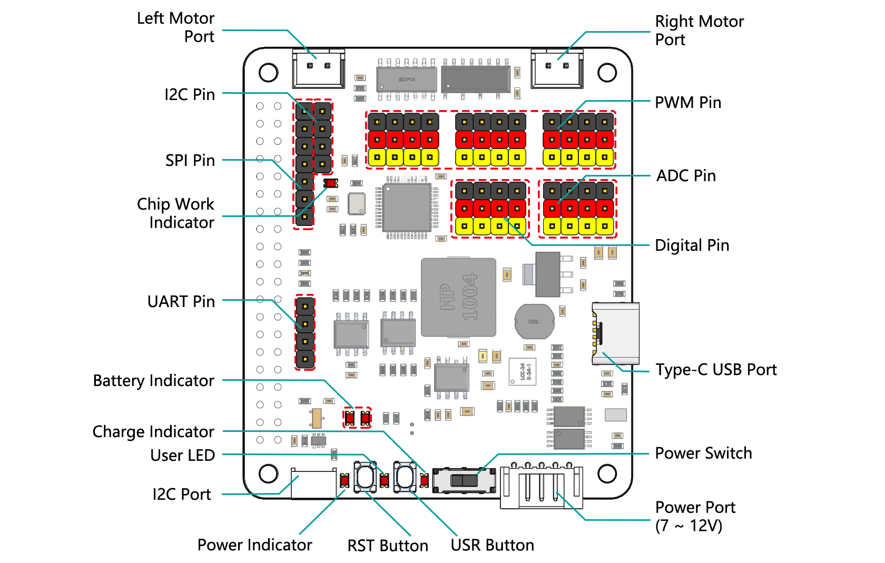

ロボットHAT
-----------------------------
|link_robot_hat_v4| は、Raspberry Piを迅速にロボットに変換することができる多機能拡張ボードです。
MCUが搭載されており、Raspberry PiのPWM出力とADC入力を拡張し、
モータードライバーチップ、I2Sオーディオモジュール、モノスピーカーも備えています。
また、Raspberry Pi自体から引き出されるGPIOもあります。

スピーカーも付属しており、
バックグラウンドミュージック、効果音、TTS機能の実装を行うことで、プロジェクトをより面白くすることができます。

7-12V PH2.0 5ピンの電源入力には2つのバッテリーインジケーター、1つの充電インジケーター、1つの電源インジケーターが付いています。
ボードには、ユーザーが簡単にいくつかの効果をテストできるLEDとボタンもあります。

**電源ポート**
    * 7-12V PH2.0 3ピンの電源入力。
    * Raspberry PiとロボットHATを同時に供給。

**電源スイッチ**
    * ロボットHATの電源をオン/オフします。
    * 電源ポートに電源を接続すると、Raspberry Piが起動します。しかし、ロボットHATを有効にするには電源スイッチをONに切り替える必要があります。

**Type-C USBポート**
    * Type-Cケーブルを差し込んでバッテリーを充電します。
    * 同時に、充電インジケーターが赤色で点灯します。
    * バッテリーが完全に充電されると、充電インジケーターが消灯します。
    * バッテリーが完全に充電された約4時間後にUSBケーブルがまだ接続されている場合、充電インジケーターが点滅してプロンプトが表示されます。

**デジタルピン**
    * 4チャンネルのデジタルピン、D0-D3。

**ADCピン**
    * 4チャンネルのADCピン、A0-A3。

**PWMピン**
    * 12チャンネルのPWMピン、P0-P11。

**左/右モーターポート**
    * 2チャンネルのXH2.54モーターポート。
    * 左ポートはGPIO 4に、右ポートはGPIO 5に接続されています。

**I2CピンとI2Cポート**
    * **I2Cピン**: P2.54 4ピンインターフェース。
    * **I2Cポート**: SH1.0 4ピンインターフェースで、QWIICとSTEMMA QTと互換性があります。
    * これらのI2Cインターフェースは、GPIO2（SDA）とGPIO3（SCL）を介してRaspberry PiのI2Cインターフェースに接続されています。

**SPIピン**
    * P2.54 7ピンSPIインターフェース。

**UARTピン**
    * P2.54 4ピンインターフェース。

**RSTボタン**
    * Ezblockを使用する場合、RSTボタンはEzblockプログラムを再起動するためのボタンとして機能します。
    * Ezblockを使用していない場合、RSTボタンには定義済みの機能はなく、必要に応じて完全にカスタマイズできます。

**USRボタン**
    * USRボタンの機能はプログラミングによって設定できます。（押し込むと入力「0」；放すと入力「1」が生成されます。）

**バッテリーインジケーター**
    * 電圧が7.6Vを超えると2つのLEDが点灯します。
    * 7.15Vから7.6Vの範囲で1つのLEDが点灯します。
    * 7.15V以下では、両方のLEDが消灯します。

**スピーカーとスピーカーポート**
    * **スピーカー**: これは2030オーディオチャンバースピーカーです。
    * **スピーカーポート**: ロボットHATにはオンボードI2Sオーディオ出力が装備されており、2030オーディオチャンバースピーカーとともにモノサウンド出力を提供します。
