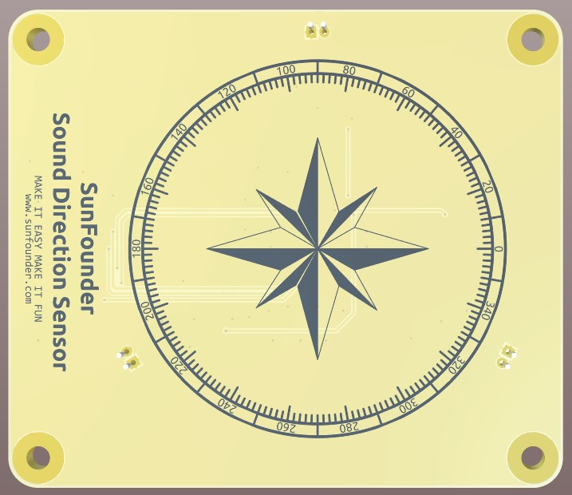
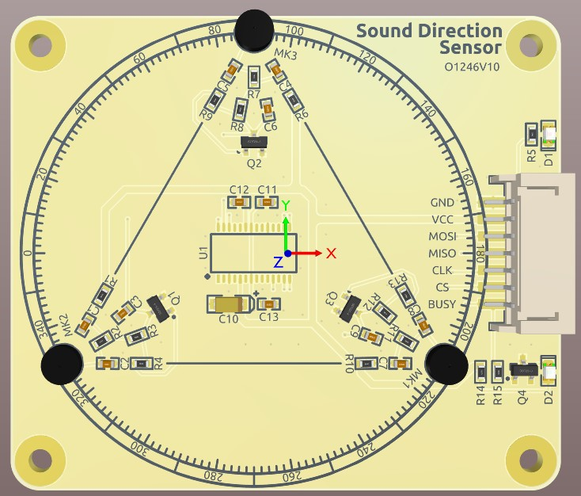

Sound Directoin Sensor
=====================================

This is a sound direction recognition module. It is equipped with 3 microphones, which can detect sound sources from all directions, and is equipped with a TR16F064B, which is used to process sound signals and calculate the sound source direction. The minimum reconnaissance unit of this module is 20 degrees, and the data range is 0~355

Data transmission process: the main controller pulls up the BUSY pin, and TR16F064B starts to monitor the direction. When 064B recognizes the direction, it will pull down the BUSY pin;
When the main control detects that BUSY is low, it will send 16bit arbitrary data to 064B (follow the MSB transmission), and accept 16bit data, which is the sound direction data processed by 064B.
After completion, the main control will pull the BUSY pin high to detect the direction again.

**Specifications**

* Power supply: 3.3V
* Communication: SPI
* Connector: PH2.0 7P
* Sound recognition angle range 360°
* Voice recognition angular accuracy ~10°

**Pin Out**

* GND - Ground Input
* VCC - 3.3V Power Supply Input
* MOSI - SPI MOSI
* MISO - SPI MISO
* SCLK - SPI clock
* CS - SPI Chip Select
* BUSY - busy detection
