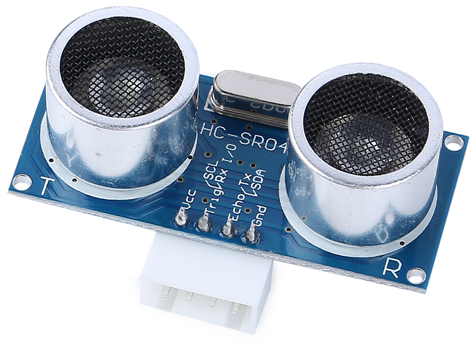

.. note::

    こんにちは、SunFounderのRaspberry Pi & Arduino & ESP32愛好家コミュニティへようこそ！Facebook上でRaspberry Pi、Arduino、ESP32についてもっと深く掘り下げ、他の愛好家と交流しましょう。

    **参加する理由は？**

    - **エキスパートサポート**：コミュニティやチームの助けを借りて、販売後の問題や技術的な課題を解決します。
    - **学び＆共有**：ヒントやチュートリアルを交換してスキルを向上させましょう。
    - **独占的なプレビュー**：新製品の発表や先行プレビューに早期アクセスしましょう。
    - **特別割引**：最新製品の独占割引をお楽しみください。
    - **祭りのプロモーションとギフト**：ギフトや祝日のプロモーションに参加しましょう。

    👉 私たちと一緒に探索し、創造する準備はできていますか？[|link_sf_facebook|]をクリックして今すぐ参加しましょう！

超音波モジュール
================================

* **TRIG**: トリガーパルス入力
* **ECHO**: エコーパルス出力
* **GND**: グラウンド
* **VCC**: 5V 電源

これはHC-SR04超音波距離センサーで、非接触測定を2cmから400cmまで、最大3mmの範囲精度で提供します。このモジュールには、超音波トランスミッター、レシーバー、および制御回路が含まれています。

測定プロジェクトに簡単に使用できるように、VCC（電源）、Trig（トリガー）、Echo（受信）、GND（グラウンド）の4ピンを接続するだけです。

**特徴**

* 動作電圧：DC5V
* 動作電流：16mA
* 動作周波数：40Hz
* 最大範囲：500cm
* 最小範囲：2cm
* トリガー入力信号：10uS TTLパルス
* エコー出力信号：入力TTLレベル信号と距離の比例
* コネクタ：XH2.54-4P
* 寸法：46x20.5x15 mm

**原理**

基本原理は以下の通りです：

* 少なくとも10usの高レベル信号でIOトリガーを使用します。
* モジュールは40kHzの超音波の8サイクルバーストを送信し、パルス信号が受信されるかどうかを検出します。
* エコーは信号が戻った場合に高レベルを出力します。高レベルの持続時間は、放出から戻るまでの時間です。
* 距離 = （高レベル時間 x 音速（340M/S））/ 2

    .. image:: img/ultrasonic_prin.jpg
        :width: 800

公式： 

* us / 58 = センチメートル距離
* us / 148 = インチ距離
* 距離 = 高レベル時間 x 速度（340M/S） / 2

**アプリケーションノート**

* このモジュールは電源投入時に接続されるべきではありません。必要な場合は、モジュールのGNDを最初に接続してください。そうしないと、モジュールの動作に影響を与えます。
* 測定対象の面積は少なくとも0.5平方メートルで、できるだけ平らでなければなりません。そうでないと、結果に影響します。
