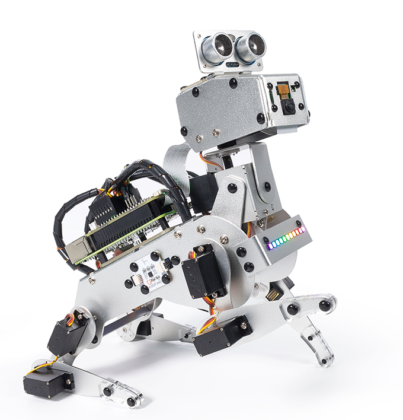

SunFounder Raspberry Pi Robot - PiDog
=============================================

Thank you for choosing our PiDog.

PiDog is a Raspberry Pi pet robot with aluminum alloy structure. It can act as a mechanical pet, show cuteness to you, and interact with you.

It is equipped with a camera module, which can perform color recognition, face detection and other projects;
12 metal gear servos support it to walk, stand, sit, shake its head, and pose in various poses;
The ultrasonic module on the head enables it to quickly detect obstacles ahead;
Special touch sensors allow it to respond to your touch;
The Light Board on the chest can emit colorful light effects, and with the speaker equipped with the robot HAT, PiDog can express emotions such as happiness and excitement.
In addition, PiDog is also equipped with a sound direction sensor and a 6-DOF IMU module to realize more complex and interesting usage scenarios.

This document includes the list and assembly pdf, hardware introduction and PiDog programming.

If you have any questions, please send an email to service@sunfounder.com and we will respond as soon as possible.

**Content**

.. toctree::
    :maxdepth: 2

    About This Kit <self>
    list_and_assembly
    python/play_with_python 
    hardware/cpn_hardware
    appendix/appendix

Copyright Notice
--------------------------

All contents including but not limited to texts, images, and code in this manual are owned by the SunFounder Company. You should only use it for personal study,investigation, enjoyment, or other non-commercial or nonprofit purposes, under therelated regulations and copyrights laws, without infringing the legal rights of the author and relevant right holders. For any individual or organization that uses these for commercial profit without permission, the Company reserves the right to take legal action.

