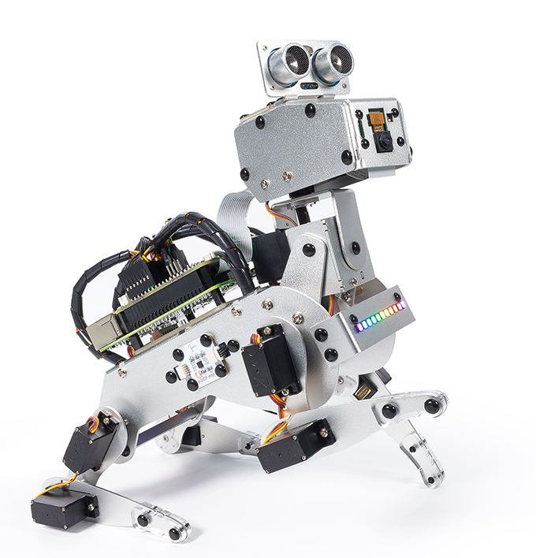

.. note::

    Bonjour, bienvenue dans la communauté SunFounder Raspberry Pi & Arduino & ESP32 Enthusiasts sur Facebook ! Plongez plus profondément dans l'univers du Raspberry Pi, Arduino et ESP32 avec d'autres passionnés.

    **Pourquoi nous rejoindre ?**

    - **Support d'experts** : Résolvez les problèmes après-vente et les défis techniques avec l'aide de notre communauté et de notre équipe.
    - **Apprendre & Partager** : Échangez des astuces et des tutoriels pour améliorer vos compétences.
    - **Aperçus exclusifs** : Bénéficiez d'un accès anticipé aux annonces de nouveaux produits et aux avant-premières.
    - **Réductions spéciales** : Profitez de réductions exclusives sur nos nouveaux produits.
    - **Promotions festives et concours** : Participez à des concours et à des promotions spéciales pendant les fêtes.

    👉 Prêt à explorer et à créer avec nous ? Cliquez sur [|link_sf_facebook|] et rejoignez-nous dès aujourd'hui !

SunFounder Raspberry Pi Robot - |link_Pi_Dog|
=================================================

* |link_PiDog|

Merci d'avoir choisi notre |link_Pi_Dog|.

.. note::
    Ce document est disponible dans les langues suivantes :

        * |link_german_tutorials|
        * |link_jp_tutorials|
        * |link_en_tutorials|
        * |link_fr_tutorials|
        * |link_es_tutorials|
        * |link_it_tutorials|
        * |link_zh_tutorials|

    Veuillez cliquer sur les liens correspondants pour accéder au document dans la langue de votre choix.

PiDog est un robot de compagnie équipé d'une structure en alliage d'aluminium. Il peut agir comme un animal de compagnie mécanique, montrer de l'affection et interagir avec vous.

Il est équipé d'un module caméra, capable de réaliser des projets de reconnaissance de couleurs, de détection de visage et bien plus encore ;
12 servos à engrenages métalliques lui permettent de marcher, de se tenir debout, de s'asseoir, de secouer la tête et d'adopter diverses postures ;
Le module ultrasonique sur sa tête lui permet de détecter rapidement les obstacles devant lui ;
Des capteurs tactiles spéciaux lui permettent de répondre à votre toucher ;
La carte lumineuse située sur sa poitrine peut émettre des effets de lumière colorés, et grâce au haut-parleur intégré au robot HAT, PiDog peut exprimer des émotions telles que la joie et l'excitation.
De plus, PiDog est également équipé d'un capteur de direction sonore et d'un module IMU à 6 DOF, permettant de créer des scénarios d'utilisation plus complexes et amusants.

Si vous avez des questions, veuillez envoyer un e-mail à service@sunfounder.com et nous vous répondrons dans les plus brefs délais.

Le produit est proposé en deux versions : Standard et V2.

**Version Standard**

    .. image:: img/pidog_v1_box.png
     :width: 500

Conçue pour être compatible avec la plupart des modèles de Raspberry Pi, cette version offre l'ensemble des fonctionnalités du kit. Toutefois, ses servomoteurs et le Robot HAT ne sont pas compatibles avec le Raspberry Pi 5, ce qui rend la version standard inadaptée à ce modèle.

**Version V2**

    .. image:: img/pidog_v2_box.png
     :width: 500

Cette version améliorée intègre un Robot HAT et une configuration de servomoteurs mis à jour, assurant la compatibilité avec les Raspberry Pi 3/4/5 et Zero 2W. Les améliorations permettent d'élargir les possibilités créatives sur Raspberry Pi 5 tout en conservant la compatibilité avec les modèles précédents.

Principales différences techniques :

* Évolution matérielle : la V2 repense les pilotes de servomoteurs et les circuits du HAT pour répondre aux exigences de tension GPIO du RPi5
* Couverture des modèles : la version Standard prend en charge les RPi 3B+/4B/Zero 2W ; la V2 ajoute la compatibilité avec le RPi5
* Gestion de l'alimentation : la V2 optimise la distribution d'énergie pour répondre aux besoins en courant plus élevés du RPi5

**Sommaire**

.. toctree::
    :maxdepth: 2

    About This Kit <self>
    assemble_video
    python/play_with_python
    ai_interaction/ai_interaction
    hardware/cpn_hardware
    appendix
    faq

Mention de droits d'auteur
-------------------------------

Tous les contenus de ce manuel, y compris mais sans s'y limiter, les textes, les images et les codes, sont la propriété de la société SunFounder. Vous ne devez les utiliser qu'à des fins d'étude personnelle, de recherche, de divertissement ou pour d'autres usages non commerciaux ou à but non lucratif, conformément aux lois et réglementations relatives aux droits d'auteur, sans enfreindre les droits légaux de l'auteur et des titulaires de droits concernés. Pour toute utilisation commerciale ou lucrative de ces contenus sans autorisation, la société se réserve le droit d'engager des poursuites judiciaires.
