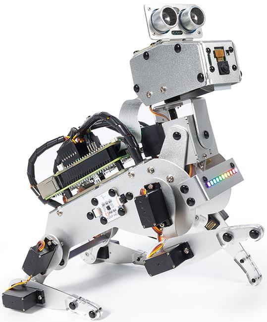

SunFounder Raspberry Pi 机器人 - |link_Pi_Dog|  
=======================================================

* |link_PiDog|  

感谢您选择我们的 |link_Pi_Dog|。  

.. note::  
    本文档提供以下语言版本。  

        * |link_german_tutorials|  
        * |link_jp_tutorials|  
        * |link_en_tutorials|  
        * |link_fr_tutorials|  
        * |link_es_tutorials|  
        * |link_it_tutorials| 
        * |link_zh_tutorials| 
    
    请点击相应的链接，以便以您偏好的语言查看文档。  

PiDog 是一款 Raspberry Pi 宠物机器人，采用铝合金结构。它可以充当机械宠物，向您展示可爱，并与您互动。  

它配备了一个摄像头模块，可以执行颜色识别、人脸检测等项目；  
12 个金属齿轮伺服电机支持其行走、站立、坐下、摇头，并摆出各种姿势；  
头部的超声波模块使其能够快速检测前方的障碍物；  
特制触摸传感器让它能响应您的触摸；  
胸部的灯光板可以发出多彩的灯光效果，并且配备的机器人 HAT 扬声器使 PiDog 能够表达喜悦、兴奋等情感。  
此外，PiDog 还配备了声音方向传感器和 6 自由度 IMU 模块，以实现更复杂和有趣的使用场景。  

如有任何问题，请发送电子邮件至 service@sunfounder.com，我们将尽快回复。  

该产品提供两个版本：Standard 和 V2。

**标准版**

    .. image:: img/pidog_v1_box.png
     :width: 500

此版本专为兼容大多数 Raspberry Pi 型号而设计，可完整发挥套件的全部功能。需要注意的是，其舵机和 Robot HAT 与 Raspberry Pi 5 不兼容，因此 Standard 版本不适用于该型号。

**V2版**

    .. image:: img/pidog_v2_box.png
     :width: 500

这一升级版本配备了全新设计的 Robot HAT 和舵机配置，可兼容 Raspberry Pi 3/4/5 以及 Zero 2W。升级后的硬件不仅支持在 Raspberry Pi 5 上实现更丰富的创意应用，同时也保持了对早期型号的向下兼容性。

主要技术区别：

* 硬件迭代：V2 重新设计了舵机驱动和 HAT 电路，以适配 RPi5 的 GPIO 电压需求
* 型号支持范围：Standard 版本支持 RPi 3B+/4B/Zero 2W；V2 新增对 RPi5 的支持
* 电源管理：V2 优化了电源供给，以满足 RPi5 更高的电流需求

**内容**  

.. toctree::  
    :maxdepth: 2  

    About This Kit <self>
    assemble_video
    python/play_with_python
    ai_interaction/ai_interaction
    hardware/cpn_hardware
    appendix/appendix
    faq

版权声明  
--------------------------

本手册中的所有内容，包括但不限于文本、图片和代码，均为 SunFounder 公司所有。您仅可在相关法规和版权法规定下，出于个人学习、研究、娱乐或其他非商业性、非盈利性目的使用，不得侵犯作者及相关权利人的合法权利。任何个人或组织未经许可擅自将这些内容用于商业牟利，SunFounder 公司保留采取法律行动的权利。

