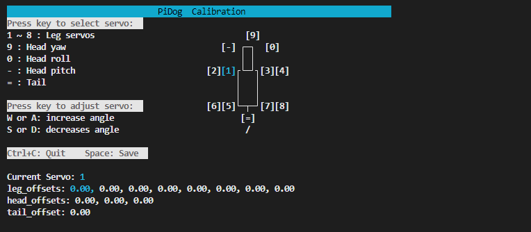

.. note::

    Bonjour et bienvenue dans la communauté SunFounder Raspberry Pi & Arduino & ESP32 Enthusiasts sur Facebook ! Plongez dans l'univers du Raspberry Pi, Arduino et ESP32 avec d'autres passionnés.

    **Pourquoi nous rejoindre ?**

    - **Support d'experts** : Résolvez les problèmes après-vente et les défis techniques avec l'aide de notre communauté et de notre équipe.
    - **Apprendre & Partager** : Échangez des astuces et des tutoriels pour développer vos compétences.
    - **Aperçus exclusifs** : Profitez d'un accès anticipé aux annonces de nouveaux produits et à des avant-premières.
    - **Réductions spéciales** : Bénéficiez de réductions exclusives sur nos derniers produits.
    - **Promotions et concours festifs** : Participez à des concours et à des promotions spéciales pendant les fêtes.

    👉 Prêt à explorer et à créer avec nous ? Cliquez sur [|link_sf_facebook|] et rejoignez-nous dès aujourd'hui !

2. Calibrer le PiDog
=============================

**Introduction**

La calibration de votre PiDog est une étape essentielle pour garantir son fonctionnement stable et efficace. Ce processus permet de corriger tout déséquilibre ou inexactitude pouvant survenir lors de l'assemblage ou en raison de problèmes structurels. Suivez attentivement ces étapes pour vous assurer que votre PiDog marche de manière fluide et fonctionne comme prévu.

.. raw:: html

   <video width="600" loop autoplay muted>
      <source src="../_static/video/calibrate_before.mp4" type="video/mp4">
      Your browser does not support the video tag.
   </video>

Cependant, si l'angle de déviation est trop important, il est nécessaire de revenir à la section :ref:`py_servo_adjust` pour régler l'angle du servo à 0°, puis de suivre les instructions pour réassembler le PiDog.

**Vidéo de calibration**

Pour un guide complet, consultez la vidéo de calibration. Elle fournit une procédure visuelle pas-à-pas pour calibrer votre PiDog avec précision.

.. raw:: html

    <iframe width="700" height="500" src="https://www.youtube.com/embed/witCWeoHTdk?si=g8_RZDUkfjdwbLZu&amp;start=871&end=1160" title="YouTube video player" frameborder="0" allow="accelerometer; autoplay; clipboard-write; encrypted-media; gyroscope; picture-in-picture; web-share" allowfullscreen></iframe>

**Étapes**

Les étapes spécifiques sont les suivantes :

#. Placez le PiDog sur la base.

    .. image:: img/place-pidog.JPG

#. Naviguez vers le répertoire des exemples de PiDog et lancez le script ``0_calibration.py``.

    .. raw:: html

        <run></run>

    .. code-block::

        cd ~/pidog/examples
        sudo python3 0_calibration.py
        
    Après avoir exécuté le script, une interface utilisateur apparaîtra dans votre terminal.

    .. image:: img/CALI.slt.1.png

#. Sélectionnez ici votre équerre de calibration (60° ou 90°). Si votre kit contient une équerre de calibration à 90°, choisissez la première option ; s'il s'agit d'une équerre de 60°, choisissez la seconde option. Après avoir sélectionné, vous verrez l'interface suivante :

Calibrage avec une équerre de 90°
---------------------------------------

#. Positionnez l'**Équerre de Calibration** (Acrylique C) comme indiqué dans l'image fournie. Dans le terminal, appuyez sur ``1``, puis utilisez les touches ``w`` et ``s`` pour aligner les bords comme illustré.

    .. image:: img/CALI-1.2.png

#. Repositionnez l'**Équerre de Calibration** (Acrylique C) comme illustré dans l'image suivante. Appuyez sur ``2`` dans le terminal, puis utilisez ``w`` et ``s`` pour aligner les bords comme montré.

    .. image:: img/CALI-2.2.png

#. Répétez le processus de calibration pour les servos restants (3 à 8). Assurez-vous que les quatre pattes du PiDog sont correctement calibrées.

Calibrage avec une équerre de 60°
--------------------------------------

#. Placez l'**Équerre de Calibration** (Acrylique C) comme montré dans l'image fournie. Posez son côté long sur une surface plane. Dans le terminal, appuyez sur ``1``, puis utilisez les touches ``w`` et ``s`` pour aligner les bords comme illustré.

    .. image:: img/CALI.60.1.JPG

#. Repositionnez l'**Équerre de Calibration** (Acrylique C) comme illustré dans l'image suivante. Appuyez sur ``2`` dans le terminal, puis utilisez ``w`` et ``s`` pour aligner les bords comme montré.

    .. image:: img/CALI.60.2.JPG

#. Répétez le processus de calibration pour les servos restants (3 à 8). Assurez-vous que les quatre pattes du PiDog sont correctement calibrées.
