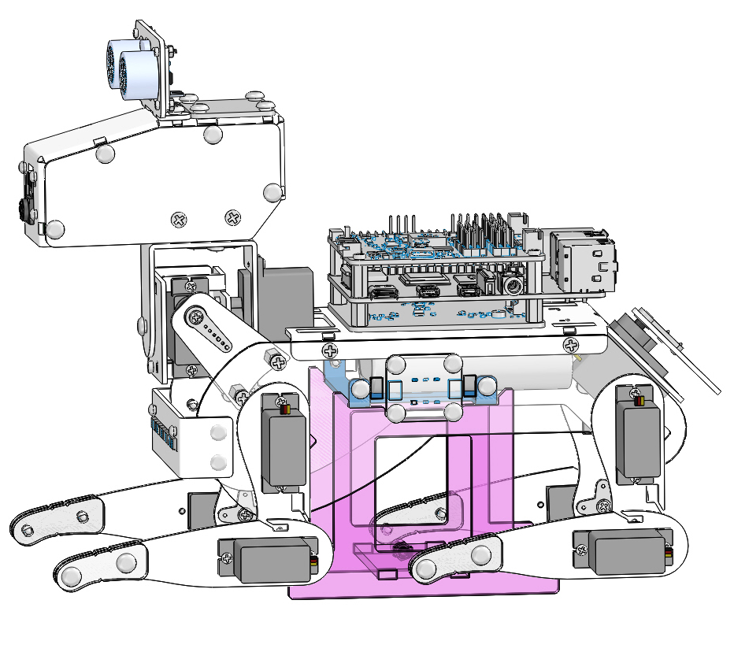
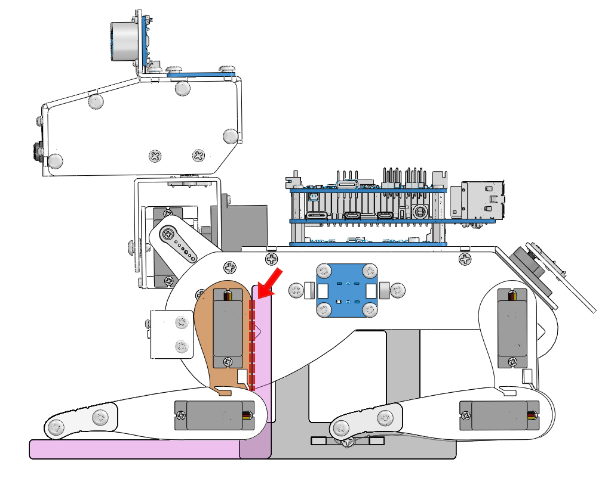
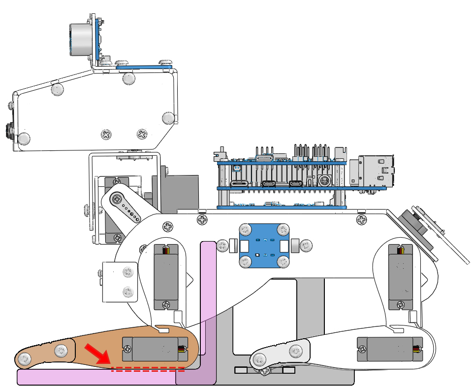

Calibrate the PiDog
=============================

Due to possible deviations during PiDog installation or limitations of the servos themselves, 
some servo angles may be slightly tilted, so you can calibrate them.

Of course you can skip this chapter if you think the assembly is perfect and doesn't require calibration.

The specific steps are as follows:

1. Put the PiDog on the base.

2. Run the ``0_calibration.py``.

    .. raw:: html

        <run></run>

    .. code-block::

        cd /home/pi/pidog/examples
        sudo python3 0_calibration.py
        
    After running the above code, you will see the following interface displayed in the terminal.

    .. image:: img/calibration_1.png

3. Place the square (Acrylic C) to the position shown in the picture. Press ``1`` in the terminal, then press ``w``, ``s`` to make the two edges marked in the figure coincide.

4. Place the square (Acrylic C) to the position shown in the picture. Press ``2`` in the terminal, then press ``w``, ``s`` to make the two edges marked in the figure coincide.

5. Configure the remaining ``3``, ``4``, ``5``, ``6``, ``7``, ``8`` servos in turn, and calibrate all four feet .