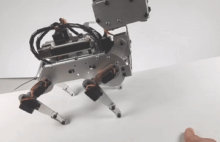

.. note::

    こんにちは、SunFounderのRaspberry Pi & Arduino & ESP32愛好家コミュニティへようこそ！Facebook上でRaspberry Pi、Arduino、ESP32についてもっと深く掘り下げ、他の愛好家と交流しましょう。

    **参加する理由は？**

    - **エキスパートサポート**：コミュニティやチームの助けを借りて、販売後の問題や技術的な課題を解決します。
    - **学び＆共有**：ヒントやチュートリアルを交換してスキルを向上させましょう。
    - **独占的なプレビュー**：新製品の発表や先行プレビューに早期アクセスしましょう。
    - **特別割引**：最新製品の独占割引をお楽しみください。
    - **祭りのプロモーションとギフト**：ギフトや祝日のプロモーションに参加しましょう。

    👉 私たちと一緒に探索し、創造する準備はできていますか？[|link_sf_facebook|]をクリックして今すぐ参加しましょう！

10. バランス
=============

PiDogには6軸IMUモジュールが搭載されているため、非常に優れたバランス感覚を持っています。

この例では、PiDogをテーブル上でスムーズに歩かせることができます。たとえテーブルの片側を持ち上げても、PiDogは緩やかな斜面でスムーズに歩くことができます。

**コードの実行**

.. raw:: html

    <run></run>

.. code-block::

    cd ~/pidog/examples
    sudo python3 10_balance.py

プログラムが実行されると、ターミナルにキーボードが表示されます。
以下のキーを入力して、斜面上でPiDogをスムーズに歩かせることができます。

.. list-table:: 
    :widths: 25 25
    :header-rows: 1

    * - キー
      - 機能
    * -  W
      -  前進 
    * -  E
      -  立つ 
    * -  A
      -  左に回る 
    * -  S
      -  後退 
    * -  D
      -  右に回る 
    * -  R
      -  体を少し持ち上げる；顕著な上昇には複数回の押下が必要。
    * -  F
      -  体を少し下げる；顕著な下降には複数回の押下が必要。

**コード**

コードは |link_code_10_balance| にあります。
