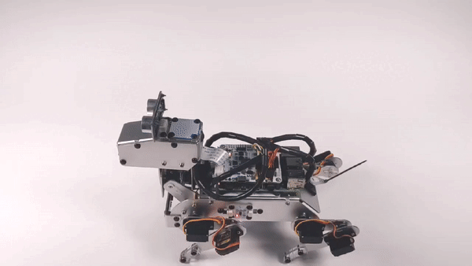

6. 持ち上げられる
===================

PiDogを地面から持ち上げてみてください。PiDogは飛べると感じ、スーパーマンのポーズで歓声をあげます。

**コードの実行**

.. raw:: html

    <run></run>

.. code-block::

    cd ~/pidog/examples
    sudo python3 6_be_picked_up.py

プログラムが実行されると、6軸IMUモジュールは常に垂直方向の加速度を計算します。
PiDogが無重力状態にあると計算された場合、スーパーマンのポーズをとり、歓声をあげます。
そうでない場合は、PiDogが平地にあると考え、立ち姿勢をとります。

**コード**

.. note::
    以下のコードを **変更/リセット/コピー/実行/停止** することができます。ただし、それにはまず ``pidog\examples`` のようなソースコードのパスに移動する必要があります。コードを変更した後、直接実行して効果を確認することができます。

.. raw:: html

    <run></run>

.. code-block:: python

    #!/usr/bin/env python3
    from pidog import Pidog
    from time import sleep

    my_dog = Pidog()
    sleep(0.1)

    def fly():
        my_dog.rgb_strip.set_mode('boom', color='red', bps=3)
        my_dog.legs.servo_move([45, -45, 90, -80, 90, 90, -90, -90], speed=60)
        my_dog.do_action('wag_tail', step_count=10, speed=100)
        my_dog.speak('woohoo', volume=80)
        my_dog.wait_legs_done()
        sleep(1)

    def stand():
        my_dog.rgb_strip.set_mode('breath', color='green', bps=1)
        my_dog.do_action('stand', speed=60)
        my_dog.wait_legs_done()
        sleep(1)

    def be_picked_up():
        isUp = False
        upflag = False
        downflag = False

        stand()

        while True:
            ax = my_dog.accData[0]
            print('ax: %s, is up: %s' % (ax, isUp))

            # gravity : 1G = -16384
            if ax < -18000: # if down, acceleration is in the same direction as gravity, ax < -1G
                my_dog.body_stop()
                if upflag == False:
                    upflag = True
                if downflag == True:
                    isUp = False
                    downflag = False
                    stand()

            if ax > -13000: # if up, acceleration is the opposite of gravity, ax will > -1G
                my_dog.body_stop()
                if upflag == True:
                    isUp = True
                    upflag = False
                    fly()
                if downflag == False:
                    downflag = True

            sleep(0.02)

    if __name__ == "__main__":
        try:
            be_picked_up()
        except KeyboardInterrupt:
            pass
        except Exception as e:
            print(f"\033[31mERROR: {e}\033[m")
        finally:
            my_dog.close()