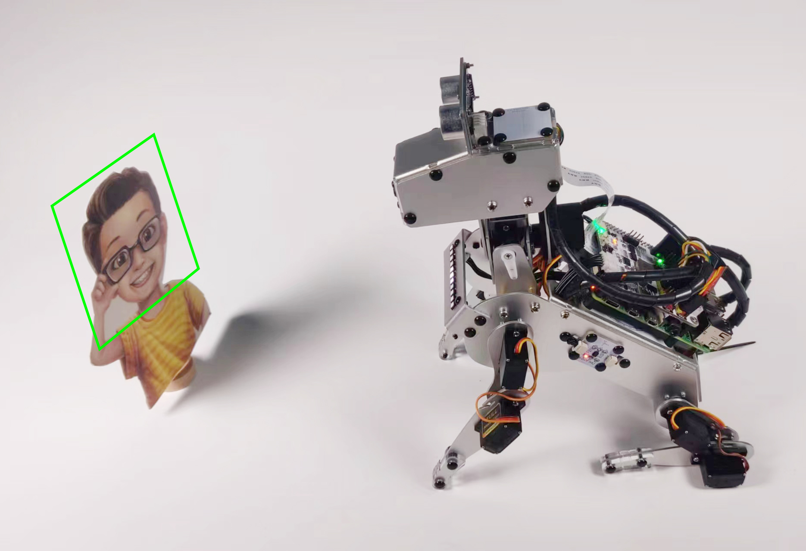

7. Face Track
======================

PiDog will sit quietly in place. You applaud it, it looks your way, and if it sees you, it says hello.

**Run the Code**

.. raw:: html

    <run></run>

.. code-block::

    cd ~/pidog/examples
    sudo python3 7_face_track.py

After running this code, PiDog will start the camera and enable the face detection function.
You can visit ``http://+ PiDog's IP +/mjpg`` (like mine is ``http://192.168.18.138:9000/mjpg``) in your browser to view the camera's picture.

Then PiDog will sit down and activate the Sound Direction Sensor Module to detect the direction of your clapping.
When PiDog hears clapping (or other noise), it turns its head toward the sound source, trying to find you.

If it sees you (face detection finds an object), it will wag its tail and let out a bark.

**Code**

.. note::
    You can **Modify/Reset/Copy/Run/Stop** the code below. But before that, you need to go to source code path like ``pidog\examples``. After modifying the code, you can run it directly to see the effect.

.. raw:: html

    <run></run>

.. code-block:: python

    #!/usr/bin/env python3
    from pidog import Pidog
    from time import sleep
    from vilib import Vilib
    from preset_actions import bark

    my_dog = Pidog()
    sleep(0.1)

    def face_track():
        Vilib.camera_start(vflip=False, hflip=False)
        Vilib.display(local=True, web=True)
        Vilib.human_detect_switch(True)
        sleep(0.2)
        print('start')
        yaw = 0
        roll = 0
        pitch = 0
        flag = False
        direction = 0

        my_dog.do_action('sit', speed=50)
        my_dog.head_move([[yaw, 0, pitch]], pitch_comp=-40, immediately=True, speed=80)
        my_dog.wait_all_done()
        sleep(0.5)
        # Cleanup sound detection by servos moving
        if my_dog.ears.isdetected():    
            direction = my_dog.ears.read()

        while True:
            if flag == False:
                my_dog.rgb_strip.set_mode('breath', 'pink', bps=1)
            # If heard somthing, turn to face it
            if my_dog.ears.isdetected():
                flag = False
                direction = my_dog.ears.read()
                pitch = 0
                if direction > 0 and direction < 160:
                    yaw = -direction
                    if yaw < -80:
                        yaw = -80
                elif direction > 200 and direction < 360:
                    yaw = 360 - direction
                    if yaw > 80:
                        yaw = 80
                my_dog.head_move([[yaw, 0, pitch]], pitch_comp=-40, immediately=True, speed=80)
                my_dog.wait_head_done()
                sleep(0.05)

            ex = Vilib.detect_obj_parameter['human_x'] - 320
            ey = Vilib.detect_obj_parameter['human_y'] - 240
            people = Vilib.detect_obj_parameter['human_n']

            # If see someone, bark at him/her
            if people > 0 and flag == False:
                flag = True
                my_dog.do_action('wag_tail', step_count=2, speed=100)
                bark(my_dog, [yaw, 0, 0], pitch_comp=-40, volume=80)
                if my_dog.ears.isdetected():
                    direction = my_dog.ears.read()

            if ex > 15 and yaw > -80:
                yaw -= 0.5 * int(ex/30.0+0.5)

            elif ex < -15 and yaw < 80:
                yaw += 0.5 * int(-ex/30.0+0.5)

            if ey > 25:
                pitch -= 1*int(ey/50+0.5)
                if pitch < - 30:
                    pitch = -30
            elif ey < -25:
                pitch += 1*int(-ey/50+0.5)
                if pitch > 30:
                    pitch = 30

            print('direction: %s |number: %s | ex, ey: %s, %s | yrp: %s, %s, %s '
                % (direction, people, ex, ey, round(yaw, 2), round(roll, 2), round(pitch, 2)),
                end='\r',
                flush=True,
                )
            my_dog.head_move([[yaw, 0, pitch]], pitch_comp=-40, immediately=True, speed=100)
            sleep(0.05)

    if __name__ == "__main__":
        try:
            face_track()
        except KeyboardInterrupt:
            pass
        except Exception as e:
            print(f"\033[31mERROR: {e}\033[m")
        finally:
            Vilib.camera_close()
            my_dog.close()
