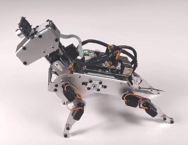

8. 腕立て伏せ
===============

PiDogは運動好きなロボットで、あなたと一緒に腕立て伏せをします。

**コードの実行**

.. raw:: html

    <run></run>

.. code-block::

    cd ~/pidog/examples
    sudo python3 8_pushup.py

プログラムを実行すると、PiDogはプランクを行い、腕立て伏せと吠え声を繰り返します。

**コード**

.. note::
    以下のコードを **変更/リセット/コピー/実行/停止** することができます。ただし、それにはまず ``pidog\examples`` のようなソースコードのパスに移動する必要があります。コードを変更した後、直接実行して効果を確認することができます。

.. raw:: html

    <run></run>

.. code-block:: python

    #!/usr/bin/env python3
    from pidog import Pidog
    from time import sleep
    from preset_actions import push_up, bark

    my_dog = Pidog()

    sleep(0.5)

    def main():
        my_dog.legs_move([[45, -25, -45, 25, 80, 70, -80, -70]], speed=50)
        my_dog.head_move([[0, 0, -20]], speed=90)
        my_dog.wait_all_done()
        sleep(0.5)
        bark(my_dog, [0, 0, -20])
        sleep(0.1)
        bark(my_dog, [0, 0, -20])

        sleep(1)
        my_dog.rgb_strip.set_mode("speak", color="blue", bps=2)
        while True:
            push_up(my_dog, speed=92)
            bark(my_dog, [0, 0, -40])
            sleep(0.4)

    if __name__ == "__main__":
        try:
            main()
        except KeyboardInterrupt:
            pass
        except Exception as e:
            print(f"\033[31mERROR: {e}\033[m")
        finally:
            my_dog.close()