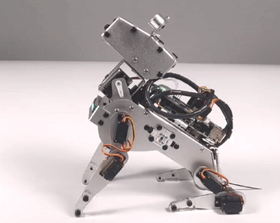

9. Heulen
===============

PiDog ist nicht nur ein süßer Welpe, sondern auch ein mächtiger Hund. Kommen Sie und hören Sie es heulen!

**Code ausführen**

.. raw:: html

    <run></run>

.. code-block::

    cd ~/pidog/examples
    sudo python3 9_howling.py

Nachdem das Programm gestartet wurde, wird PiDog sich auf den Boden setzen und heulen.

**Code**

.. note::
    Sie können den unten stehenden Code **modifizieren/zurücksetzen/kopieren/ausführen/stoppen**. Bevor Sie das tun, müssen Sie jedoch zum Quellcode-Pfad wie ``pidog\examples`` gehen. Nachdem Sie den Code modifiziert haben, können Sie ihn direkt ausführen, um den Effekt zu sehen.

.. raw:: html

    <run></run>

.. code-block:: python

    #!/usr/bin/env python3
    from pidog import Pidog
    from time import sleep
    from preset_actions import howling

    my_dog = Pidog()

    sleep(0.5)

    def main():
        my_dog.do_action('sit', speed=50)
        my_dog.head_move([[0, 0, 0]], pitch_comp=-40, immediately=True, speed=80)
        sleep(0.5)
        while True:
            howling(my_dog)

    if __name__ == "__main__":
        try:
            main()
        except KeyboardInterrupt:
            pass
        except Exception as e:
            print(f"\033[31mERROR: {e}\033[m")
        finally:
            my_dog.close()

