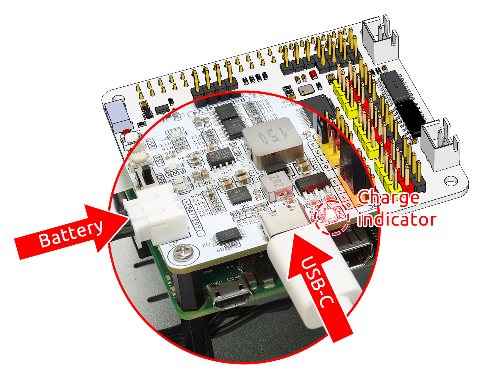
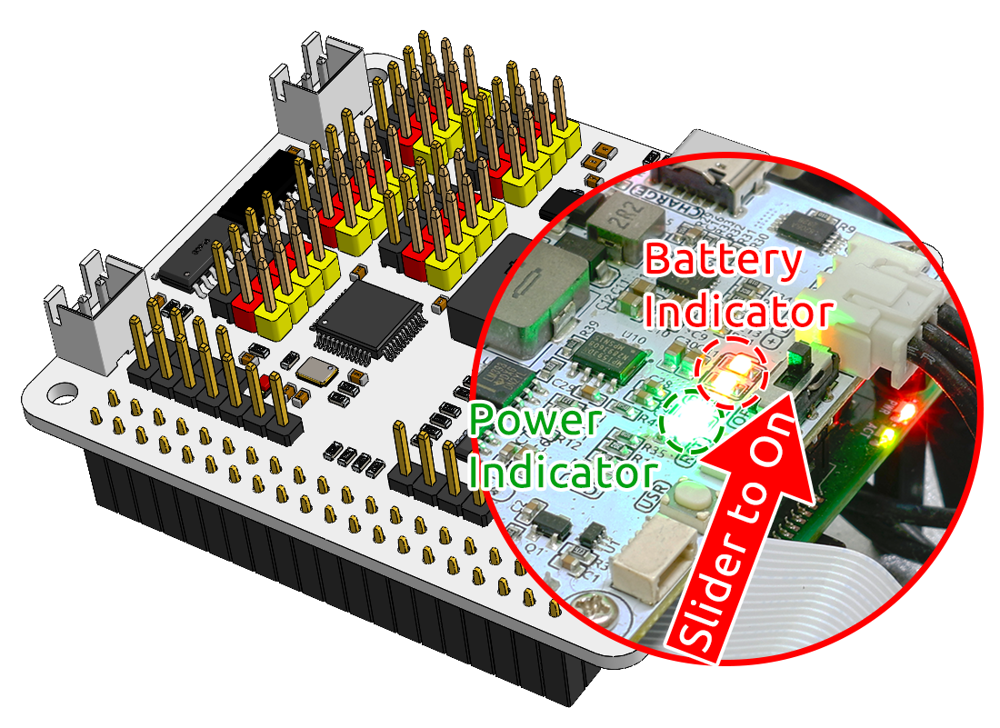

.. note::

    Bonjour, bienvenue dans la communauté SunFounder Raspberry Pi & Arduino & ESP32 Enthusiasts sur Facebook ! Plongez plus profondément dans l’univers de Raspberry Pi, Arduino et ESP32 avec d’autres passionnés.

    **Pourquoi rejoindre ?**

    - **Support d'experts** : Résolvez les problèmes après-vente et relevez les défis techniques avec l'aide de notre communauté et de notre équipe.
    - **Apprendre et partager** : Échangez des astuces et des tutoriels pour améliorer vos compétences.
    - **Aperçus exclusifs** : Bénéficiez d’un accès anticipé aux annonces de nouveaux produits et à des avant-premières.
    - **Réductions spéciales** : Profitez de remises exclusives sur nos produits les plus récents.
    - **Promotions festives et concours** : Participez à des concours et à des promotions spéciales lors des fêtes.

    👉 Prêt à explorer et à créer avec nous ? Cliquez sur [|link_sf_facebook|] et rejoignez-nous dès aujourd'hui !

3. Alimentation pour le Raspberry Pi (Important)
===================================================

Chargement
-------------------

Insérez le câble de la batterie. Ensuite, connectez le câble USB-C pour charger la batterie.
Vous devrez utiliser votre propre chargeur ; nous recommandons un chargeur de 5V 3A, ou votre chargeur de smartphone habituel fera l'affaire.

.. note::
    Connectez une source d'alimentation externe Type-C au port Type-C du robot hat ; le chargement de la batterie commencera immédiatement et un voyant rouge s'allumera.\
    Une fois la batterie complètement chargée, le voyant rouge s'éteindra automatiquement.

Mise sous tension
----------------------

Allumez l'interrupteur d'alimentation. Le voyant d'alimentation ainsi que l'indicateur de niveau de batterie s'allumeront.

Attendez quelques secondes et vous entendrez un léger bip, indiquant que le Raspberry Pi a démarré avec succès.

.. note::
    Si les deux voyants de niveau de batterie sont éteints, veuillez recharger la batterie.
    Lorsque vous effectuez des sessions de programmation ou de débogage prolongées, vous pouvez maintenir le Raspberry Pi en fonctionnement en connectant le câble USB-C pour charger simultanément la batterie.