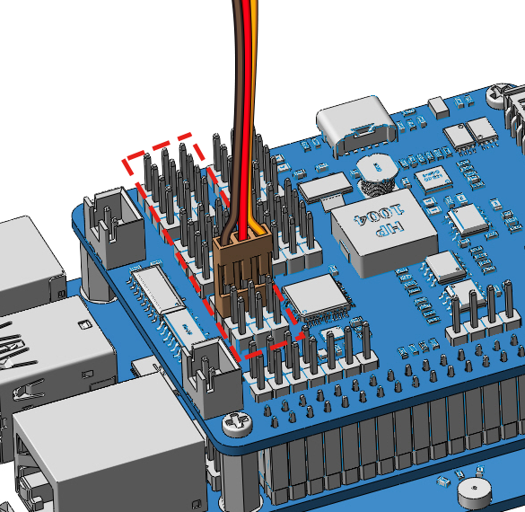

.. _py_servo_adjust:

6. Servo Adjust
===================

The angle range of the servo is -90~90, but the angle set at the factory is random, maybe 0°, maybe 45°; if we assemble it with such an angle directly, it will lead to a chaotic state after the robot runs the code, or worse, it will cause the servo to block and burn out.

So here we need to set all the servo angles to 0° and then install them, so that the servo angle is in the middle, no matter which direction to turn.

#. To ensure that the servo has been properly set to 0°, first insert the servo arm into the servo shaft and then gently rotate to any angle.

    .. image:: img/servo_arm.png

Now, run ``servo_zeroing.py`` in the ``examples/`` folder.

.. raw:: html

    <run></run>

.. code-block::

    cd ~/pidog/examples
    sudo python3 servo_zeroing.py

.. note::
    If you get an error, try re-enabling the Raspberry Pi's I2C port, see: :ref:`i2c_spi_config`.

Next, plug the servo cable into the **any PWM port**.

At this point you will see the servo arm rotate to a specific position (0°).

Now you can continue the installation as instructed on the assembly foldout.

.. note::

    * Do not unplug this servo cable before fixing it with the servo screw, you can unplug it after fixing it.
    * Do not rotate the servo while it is powered on to avoid damage; if the servo shaft is not inserted at the right angle, pull the servo out and reinsert it.
    * Before assembling each servo, you need to plug the servo cable into PWM pin and turn on the power to set its angle to 0°.

