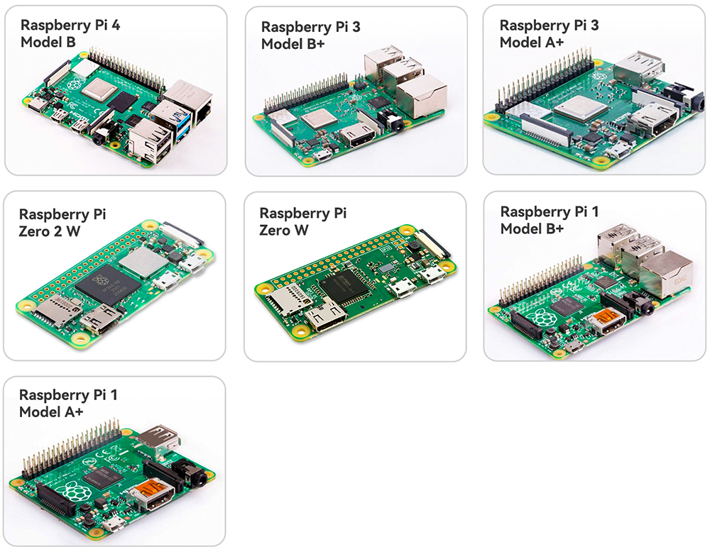

1. 我们需要什么？
=============================

必备组件  
-----------------------

**Raspberry Pi**

Raspberry Pi 是一款低成本、信用卡大小的计算机，可连接到计算机显示器或电视，使用标准的键盘和鼠标。  
它是一款功能强大的小型设备，能够让所有年龄段的人探索计算机世界，并学习如何使用 Scratch 和 Python 等编程语言。

对于 V2 版，你也可以使用 Raspberry Pi 5。

**电源适配器**

Raspberry Pi 通过一个微型 USB 端口（与许多手机相同）连接电源。
你需要一款至少提供 2.5 安培电流的电源适配器。

**Micro SD 卡**

Raspberry Pi 需要一张 Micro SD 卡来存储所有文件和 Raspberry Pi 操作系统。
你需要一张容量至少为 8 GB 的 Micro SD 卡。

可选组件  
-------------------------

**显示器**

要查看 Raspberry Pi 的桌面环境，你需要一个显示器，可以是电视屏幕或计算机显示器。
如果显示器内置扬声器，Pi 会通过扬声器播放声音。

**鼠标和键盘**

当你使用显示器时，还需要一套 USB 键盘和 USB 鼠标。

**HDMI**

Raspberry Pi 配备一个 HDMI 输出端口，兼容大多数现代电视和计算机显示器的 HDMI 端口。
如果你的显示器仅有 DVI 或 VGA 端口，你需要使用相应的转换线。

**机箱**

你可以将 Raspberry Pi 放入机箱中，这样可以保护你的设备。

**音响或耳机**

Raspberry Pi 配备一个 3.5 毫米的音频端口，当你的显示器没有内置扬声器或没有显示器时，可以使用它来播放音频。
