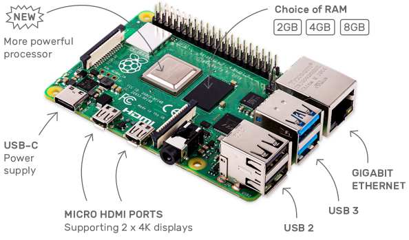

.. note::

    こんにちは、SunFounderのRaspberry Pi & Arduino & ESP32愛好家コミュニティへようこそ！Facebook上でRaspberry Pi、Arduino、ESP32についてもっと深く掘り下げ、他の愛好家と交流しましょう。

    **参加する理由は？**

    - **エキスパートサポート**：コミュニティやチームの助けを借りて、販売後の問題や技術的な課題を解決します。
    - **学び＆共有**：ヒントやチュートリアルを交換してスキルを向上させましょう。
    - **独占的なプレビュー**：新製品の発表や先行プレビューに早期アクセスしましょう。
    - **特別割引**：最新製品の独占割引をお楽しみください。
    - **祭りのプロモーションとギフト**：ギフトや祝日のプロモーションに参加しましょう。

    👉 私たちと一緒に探索し、創造する準備はできていますか？[|link_sf_facebook|]をクリックして今すぐ参加しましょう！

1. 必要なものは何ですか？
==============================

必要なコンポーネント
------------------------

**Raspberry Pi**

Raspberry Piは、低コストでクレジットカードサイズのコンピュータで、コンピュータモニターやテレビに接続し、標準のキーボードとマウスを使用します。この小さなデバイスを使えば、あらゆる年齢の人々がコンピューティングを探求し、ScratchやPythonなどの言語でプログラミングを学ぶことができます。

**電源アダプター**

電源ソケットに接続するために、Raspberry PiにはマイクロUSBポート（多くの携帯電話に見られるものと同じ）があります。少なくとも2.5アンペアを提供する電源が必要です。

**マイクロSDカード**

Raspberry Piは、すべてのファイルとRaspberry Pi OSを保存するために、マイクロSDカードが必要です。少なくとも8GBの容量があるマイクロSDカードが必要です。

オプションのコンポーネント
-----------------------------

**スクリーン**

Raspberry Piのデスクトップ環境を見るためには、テレビ画面またはコンピュータモニターを使う必要があります。スクリーンにスピーカーが内蔵されている場合、Piはそれらを通して音を再生します。

**マウス＆キーボード**

スクリーンを使用する場合、USBキーボードとUSBマウスも必要です。

**HDMI**

Raspberry Piには、ほとんどの現代のテレビやコンピュータモニターのHDMIポートと互換性のあるHDMI出力ポートがあります。画面にDVIポートやVGAポートしかない場合は、適切な変換ケーブルが必要になります。

**ケース**

Raspberry Piをケースに入れることができます。これにより、デバイスを保護することができます。

**サウンドまたはイヤホン**

Raspberry Piには約3.5mmのオーディオポートが装備されており、スクリーンに内蔵スピーカーがない場合やスクリーンを操作しない場合に使用できます。

